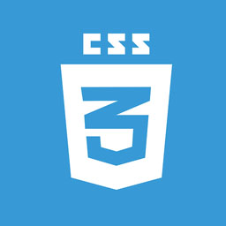
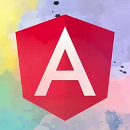
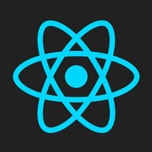
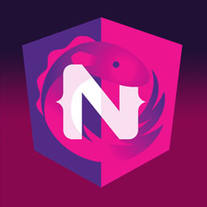
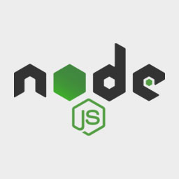
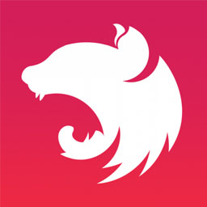

### 👋 Hello! I'm Deepak J. | Nice to See You.
Full Stack Javascript Developer - Javascript, Angular, React, Vue, Ionic, Node.js, MongoDB, Handlebar, HTML & CSS

<b>About Me ✨</b>

- ✨ Experience of 10 Years+ as Javascript Developer.
- 🌱 Web and Mobile application development using HTML, CSS and JavaScript.
- ✨ Good Experience in Angular (5+Years) and Basic knowledge of React.
- 🌱 Hybrid application development using Ionic Framework.
- ✨ Good experience in Bootstrap and CSS pre-processors like SCSS etc.
- 🌱 Experience with Version management tools such as Git, and SVN etc.
- ✨ Experience with Build, Dependency tools such as Webpack, Grunt, Bower, NPM etc.
- 🌱 Focused on Test Driven Development (TDD) and able to write Unit Test using Karma/Jest/Jasmine.
- ✨ Knowledge of Rest API and Full Stack development in JavaScript with NodeJS.
- 🌱 Basic understanding of MongoDB and Database queries with Mongoose.
- ✨ Good Communication skill with fluency in written and spoken English

 

<h2 align="left" id="macropower-tech">Favorite Tech</h2>

> Tools, languages, and other things that I like to work with.

<table style="width:100%">
  <tr>
    <td align="center" width="16.66%">
      
       Javascript
    </td>
    <td align="center" width="16.66%">
      
       jQuery
    </td>
    <td align="center" width="16.66%">
      
       HTML
    </td>
    <td align="center" width="16.66%">
      
       CSS
    </td>
    <td align="center" width="16.66%">
      
       Bootstrap
    </td>
    <td align="center" width="16.66%">
      
       SASS
    </td>
  </tr>
  <tr>
    <td align="center" width="16.66%">
      
       Ionic
    </td>
    <td align="center" width="16.66%">
      
       Angular
    </td>
    <td align="center" width="16.66%">
      
       Typescript
    </td>
    <td align="center" width="16.66%">
      
       React
    </td>
    <td align="center" width="16.66%">
      
       Vue.js
    </td>
    <td align="center" width="16.66%">
      
       NGRX
    </td>
  </tr>
  <tr>
    <td align="center" width="16.66%">
      
       Node.js
    </td>
    <td align="center" width="16.66%">
      
       Express
    </td>
    <td align="center" width="16.66%">
      
       Nest.js
    </td>
    <td align="center" width="16.66%">
      
       MongoDB
    </td>
    <td align="center" width="16.66%">
      
       Mongoose
    </td>
    <td align="center" width="16.66%">
      
       Elasticsearch
    </td>
  </tr>
  <tr>
    <td align="center" width="16.66%"> 
      
       SQLite
    </td>
    <td align="center" width="16.66%"> 
      
       Redis
    </td>
    <td align="center" width="16.66%">
      
       Postgress
    </td>
    <td align="center" >
      
       AWS
    </td>
    <td align="center" width="16.66%">
      
       GCP
    </td>
    <td align="center" >
      
       NGINX
    </td>
  </tr>
  <tr>
    <td align="center" >
      
       Git
    </td>
    <td align="center" width="16.66%">
      
       Bitbucket
    </td>
    <td align="center" >
      
       Jenkins
    </td>
    <td align="center" width="16.66%">
      
       Gitlab
    </td>
    <td align="center" width="96">
      
       webpack
    </td>
    <td align="center" width="96">
      
       more..
    </td>
  </tr>
</table>

 
<h2 align="left" id="macropower-tech">Connect with Me:</h2>

- :raising_hand_man: Connect with me on **[LinkedIn](https://www.linkedin.com/in/dkjhaaa/)**
- 📊 Follow me on **[StackOverflow](https://stackoverflow.com/users/6510256/deepak-jha)**

 

 <em><b>I love connecting with different people</b> so if you want to say <b>hi, I'll be happy to meet you more!</b> 😊</em>
 

